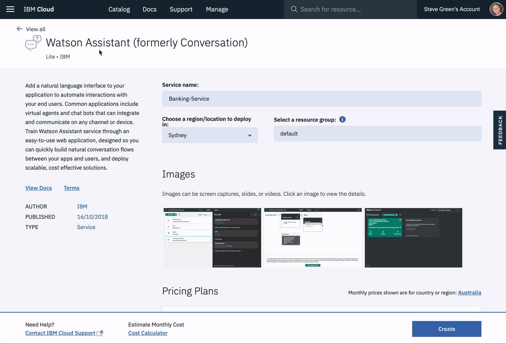

# iAdvize Connector

[](https://www.gnu.org/licenses/gpl-3.0)

> **Note:** This is the Node.js version of the connector previously written in Go

This project is a connector for iAdvize, to use IBM Watson as a bot plugin

- [iAdvize Connector](#iadvize-connector)
  - [Prerequisites](#prerequisites)
  - [Configuring the application](#configuring-the-application)
  - [Run the server in local](#run-the-server-in-local)
  - [Deployment](#deployment)
  - [Create the iAdvize Bot Plugin](#create-the-iadvize-bot-plugin)
  - [Setup the Plugin on the iAdvize admin platform](#setup-the-plugin-on-the-iadvize-admin-platform)
  - [The Chat application](#the-chat-application)

## Prerequisites

1. Sign up for an [IBM Cloud account](https://cloud.ibm.com/registration/).
2. Download the [IBM Cloud CLI](https://cloud.ibm.com/docs/cli/index.html#overview).
3. Create an instance of the Watson Assistant service and get your credentials:
    - Go to the [Watson Assistant](https://cloud.ibm.com/catalog/services/conversation) page in the IBM Cloud Catalog.
    - Log in to your IBM Cloud account.
    - Click **Create**.
    - Click **Show** to view the service credentials.
    - Copy the `apikey` value, or copy the `username` and `password` values if your service instance doesn't provide an `apikey`.
    - Copy the `url` value.

## Configuring the application

1. In your IBM Cloud console, open the Watson Assistant service instance

2. Click the **Import workspace** icon in the Watson Assistant service tool. Specify the location of the workspace JSON file in your local copy of the app project:

    `<project_root>/training/bank_simple_workspace.json`

3. Select **Everything (Intents, Entities, and Dialog)** and then click **Import**. The car dashboard workspace is created.

4. Click the menu icon in the upper-right corner of the workspace tile, and then select **View details**.

5. Click the  icon to copy the workspace ID to the clipboard.

    

6. In the application folder, copy the *.env.example* file and create a file called *.env*

    ```bash
    cp .env.example .env
    ```

7. Open the *.env* file and add the service credentials that you obtained in the previous step. The Watson SDK automatically locates the correct environmental variables for either `username`, `password`, and `url` or the `apikey` and `url` credentials found in the *.env* file.

    Example *.env* file that configures the `apikey` and `url` for a Watson Assistant service instance hosted in the US East region:

    ```.env
    ASSISTANT_IAM_APIKEY=X4rbi8vwZmKpXfowaS3GAsA7vdy17Qh7km5D6EzKLHL2
    ASSISTANT_URL=https://gateway-wdc.watsonplatform.net/assistant/api
    ```

    - If your service instance uses `username` and `password` credentials, add the `ASSISTANT_USERNAME` and `ASSISTANT_PASSWORD` variables to the *.env* file.

    Example *.env* file that configures the `username`, `password`, and `url` for a Watson Assistant service instance hosted in the US South region:

    ```.env
    ASSISTANT_USERNAME=522be-7b41-ab44-dec3-g1eab2ha73c6
    ASSISTANT_PASSWORD=A4Z5BdGENrwu8
    ASSISTANT_URL=https://gateway.watsonplatform.net/assistant/api
    ```

    However, if your credentials contain an IAM API key, copy the `apikey` and `url` to the relevant fields.

    ```JSON
      {
        "apikey": "ca2905e6-7b5d-4408-9192-e4d54d83e604",
        "iam_apikey_description": "Auto generated apikey during resource-key ...",
        "iam_apikey_name": "auto-generated-apikey-62b71334-3ae3-4609-be26-846fa59ece42",
        "iam_role_crn": "crn:v1:bluemix:public:iam::::serviceRole:Manager",
        "iam_serviceid_crn": "crn:v1:bluemix:public:iam...",
        "url": "https://gateway-syd.watsonplatform.net/assistant/api"
      }
    ```

    ```.env
    ASSISTANT_IAM_APIKEY=ca2905e6-7b5d-4408-9192-e4d54d83e604
    ```

8. Add the `ASSISTANT_ID` to the previous properties

    ```.env
    ASSISTANT_ID=522be-7b41-ab44-dec3-g1eab2ha73c6
    ```

## Run the server in local

1. Set credentials

   - First, rename the _.env.example_ file to _.env_ : 

       ```bash
       cp .env.example .env
       ```

   - Fill it with your own Watson and iAdvize credentials

2. Install Dependencies

    ```bash
    npm install
    ```

3. Run the server

    ```bash
    npm start
    ```

The server now runs on <http://loaclhost:8080>

## Deployment

You will need to deploy this connector in order to use it with iAdvize. You can deploy this anywhere so i won't cover this part in this tutorial. [Here is a link](https://cloud.ibm.com/docs/runtimes/nodejs?topic=Nodejs-getting-started#getting-started) to a tutorial to deploy an Node.js Application on IBM Cloud with Cloud Foundry

## Create the iAdvize Bot Plugin

1. In the [iAdvize Developper Platform](https://developers.iadvize.com/) go to "My Apps" and click on the "Build button
2. Give your application a name and click on "Next" and the "Build"
3. Here you can setup your connector, you can give it a description or a icon that you can change [here](assets/images/logo.png)
4. Open the "Plugins" tab and select the "Bot" in the plugin list.
5. Here you can set your connector URI like this : `http://<your-production-url>/api/iadvize`

## Setup the Plugin on the iAdvize admin platform

1. In the [iAdvize Admin Platform](https://ha.iadvize.com) go to "Team" and click on the "+" sign to add a new user.
2. Click on "Bot" in the list of all users, give it a name and select your bot in the "Select a bot" field
3. Choose your scenario and click on the "Save" button.

## The Chat application

A static content containing a sample chat application is being served at the root of your application : `https://<your-production-url>/`

This static content has been taken from the [iAdvize Admin Platform](https://ha.iadvize.com) but you need to use your own scripts. Here is how to find them :

1. Go to the [iAdvize Admin Platform](https://ha.iadvize.com) and click on the user icon on the top right of the screen.

2. Click on "Projects" then click on "Integration".

You will the find a sample code to copy/paste.